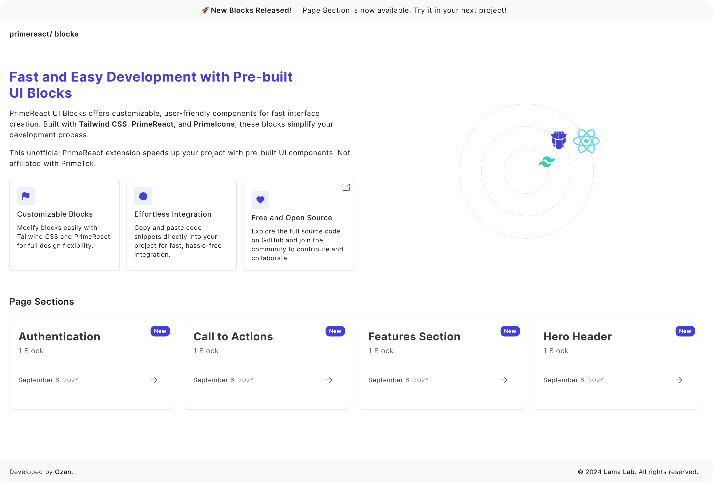
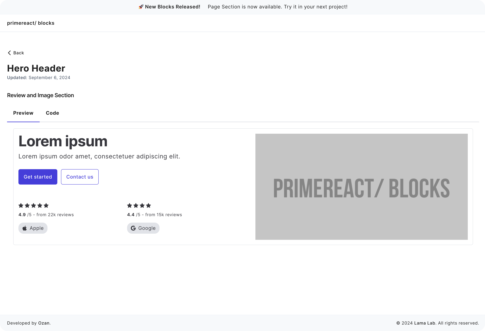

# PrimeReact/ ui blocks

PrimeReact UI Blocks offers customizable, user-friendly components for fast interface creation. Built with Tailwind CSS, PrimeReact, and PrimeIcons, these blocks simplify your development process.

## Screenshots

## To-Do List

### September

- [x] Complete basic features for the initial release
- [ ] Create 10 blocks
- [ ] Add dynamic metadata
- [ ] Enhance user experience for preview/code functionality\*\*
- [ ] Redesign layout to include a sidebar

## Contributing

We welcome contributions from the community! Here's how you can help:

1. **Fork the repository**: Click the "Fork" button at the top right of this page to get your own copy of the project.
2. **Create a new branch**: Create a new branch from `main` to work on (`git checkout -b feature/your-feature-name`).
3. **Make your changes**: Improve the code, add new features, fix bugs, or enhance the documentation.
4. **Submit a pull request (PR)**: Once your changes are ready, submit a pull request with a clear description of what you’ve done and why.

### Contribution Guidelines

#### Commit Messages

- Use clear and concise commit messages that describe **what** and **why** you made changes (e.g., `Add user authentication feature`, `Fix bug in preview layout`).
- Keep your commit messages in English and follow the general format:  
  `type(scope): description`
  - **type**: The type of change (e.g., `fix`, `feat`, `chore`, `docs`, etc.).
  - **scope**: The area of the project affected (optional).
  - **description**: A brief description of the changes.

#### Pull Request (PR) Guidelines

- Ensure your PR has a descriptive title and provides details about the changes introduced.
- Reference the issue number in your PR if it solves an existing issue (e.g., `Closes #123`).
- Keep your PR focused: group related changes together. Avoid including unrelated modifications.
- Run all tests locally before submitting your PR to ensure no breaking changes.
- Add relevant documentation and update any affected README sections.
- Engage in the PR review process by addressing feedback and suggestions promptly.

We look forward to your contributions!
